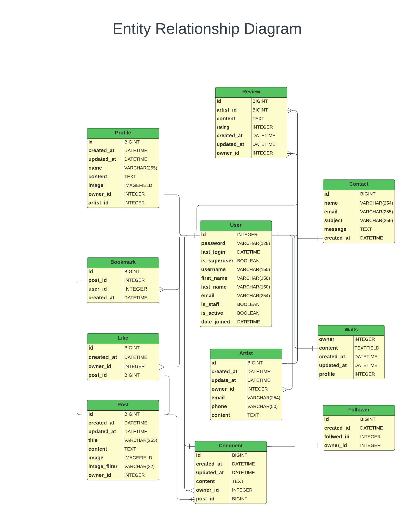
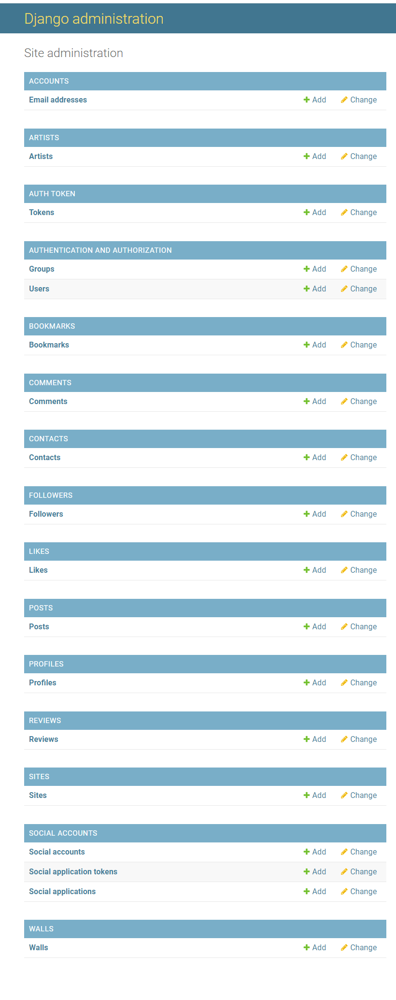
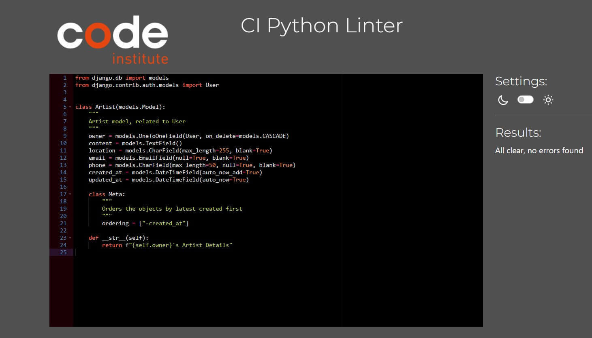
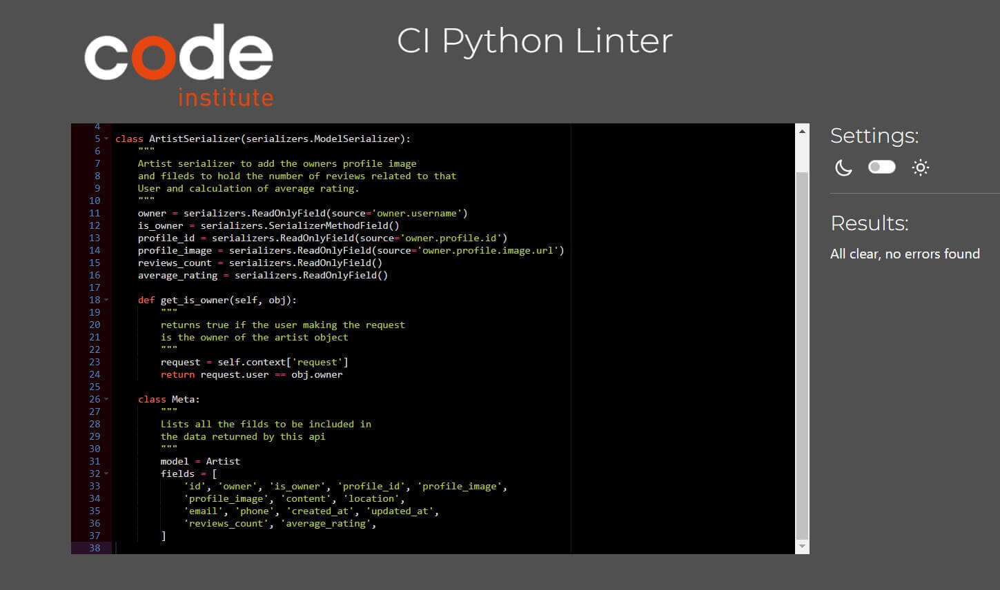
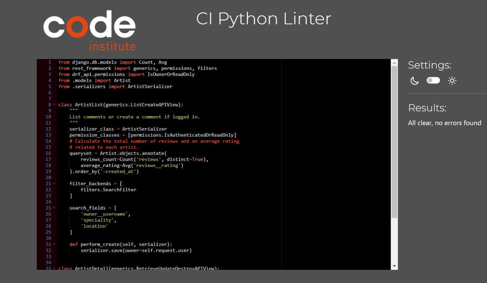

# Artistery Avenue API
"Artisery Avenue Api" is the backend service used by the [Artistery Avenue](https://) platform.
The deployed DjangoRESTFramework API can be found [here](https://th-1982-artistery-avenue-198c22334f81.herokuapp.com/)

# Purpose of the API:
To serve as the backend infrastructure for the front end by posting  (POST) and retrieving (GET) data from endpoints and performing create, read, update, and delete operations on objects users enter via the front end. 


## Planning & Agile:
This [project](https://github.com/users/th-1982/projects/12/views/1?visibleFields=%5B%22Title%22%2C%22Assignees%22%2C%22Status%22%2C74798578%2C74798580%2C74798579%2C%22Milestone%22%2C%22Labels%22%5D) was planned and developed using Agile methodology and MoSCoW prioritization.

For this purpose, the project was illustrated by [11 initial Milestone](https://github.com/th-1982/artistery-avenue-api/milestones) entitled "Profiles", "Posts", "Likes", "Comments", "Followers", "Reviews", "Walls", "Artist", "Contacts", "Bookmarks" and "Miscellaneous" providing the developer with the freedom to accomplish all issues/tasks flexibly before dates deadline set to March. The Milestones were broken according to their component's names.

Throughout the development process, new milestones were added, where tasks started from "Todo," progressing to "In Progress," and finally "Done." The issues were assigned to the sole developer and labeled as "could-have," "should-have," "must-have," and "won't-have".


In order of priority, with [88 closed User Stories](https://github.com/th-1982/artistery-avenue-api/issues), the Project has:

Must-Have:
- Models, Views, Serializers, Urls for "profiles/posts/comments/likes/reviews/walls/artists/bookmarks"
- Set Up and Deployment
- View Artist Profiles(Artists)
- Artist Profile Permission(Artists)
- View Bookmarks(Bookmarks)
- Bookmark Permission(Bookmarks)
- View Users Profiles (Profiles)
- Profiles Permissions (Profiles)
- View Posts (Posts)
- Create a Post (Posts)
- Post Permissions (Posts)
- View Comments (Comments)
- Create a Comment (Comments)
- View Likes(Likes)
- Like/Unlike a Post or Comment(Likes)
- Like Permissions (Likes)
- View Contacts (Contacts)
- View Reviews(Reviews)
- Reviews Permissions (Reviews)
- View Contact (Contacts)
- Create a Contact(Contact)
- Create a Review (Reviews)
- Wall posts Permissions (Walls)
- View Wall Post(Walls)
- Create a Wall post (Walls)
- View Followers(Followers)
- Follow a User(Followers)


Should-Have:
- Models, Views, Serializers, Urls for "followers/contacts
- Update Artist Profile(Artists)
- Filter Artists(Artists)
- Create a Bookmarks (Bookmarks)
- Update my Bookmarks (Bookmarks)
- Delete a Bookmarks (Bookmarks)
- View Users Detail Profile (Profile)
- Update User Profile (Profile)
- Delete User Profile (Profile)
- Filter Posts (Posts)
- Update my Post (Posts)
- Like a Post (Posts)
- Comment on a Post (Posts)
- View Comments Details (Comments)
- Update my Comment (Comment)
- Delete my Comment (Comment)
- View Like (Likes)
- Like/Unlike a Post (Likes)
- View Like Details (Likes)
- View Followers (Followers)
- Follow a User (Followers)
- Unfollow a User (Followers)
- View Follower Details (Followers)
- View a Contact Detailed (Contacts)
- Update My Contact(Contact)
- Delete My Contact (Contacts)
- Contact Premissions (Admin Contacts)
- View Contacts Details (Admin Contacts)
- View Reviews Details (Reviews)
- Update my Review (Reviews)
- View Wall posts Details (Walls)
- Update my Wall Post (Walls)

Could-Have:
- Models, Views, Serializers, Urls for "likes/admin contacts"
- Search for Artists(Artists)
- View Bookmark Details (Bookmarks)
- Search for Bookmarks (Bookmarks)
- View User Detail Profile (Profiles)
- Search for Posts (Posts)
- View Posts Details (Posts)
- Search for Comments (Comments)
- Like a Comment (Comments)
- Search for Reviews (Reviews)
- Search for Wall Posts (Walls)
- Search for Followers (Followers)
- Search for Contacts (Contacts)
- Delete a Contact (Admin Contacts)
- Update a Contact (Admin Contacts)

Wont-Have:
- Remove a Follower (Followers)
- Delete Artist Profile (Artists)
- Delete Multiple Bookmarks (Bookmarks)
- Delete Another User's Profile (Profiles)
- Delete Another User's Post (Posts)
- Delete Another User's Comments (Comments)
- Unlike Another User's Like (Likes)
- Delete Another User's Review (Reviews)
- Delete my Review (Reviews)
- Delete my Wall post (Walls)
- Delete Another User's Wall Post (Walls)
- Delete Another User's Contacts (Contacts)

The issues were closed, and the milestones were subsequently closed, too.

## Relationship Diagram
The relationship diagram for Artistry Avenue between models from an individual perspective can be best defined as follows:

- The [Profile](https://th-1982-artistery-avenue-198c22334f81.herokuapp.com/profiles/) model serves as the central entity, featuring attributes such as owner (OneToOne), created_at (DateTimeField), updated_at (DateTimeField), name (CharField), content (TextField), image (ImageField with a unique filename generated by rename_file), and is_artist (BooleanField) indicating whether the profile is an artist.
- A [Post](https://th-1982-artistery-avenue-198c22334f81.herokuapp.com/posts/) created by a User Profile on Artistry Avenue and features the owner (ForeignKey), created_at (DateTimeField), updated_at (DateTimeField), title (CharField), content (TextField), image (ImageField), and image_filter (CharField) once submitted.
- The [Comments](https://th-1982-artistery-avenue-198c22334f81.herokuapp.com/comments/) model follows a similar structure, inheriting from the post (ForeignKey) and owner (ForeignKey). It displays the content (TextField), created_at (DateTimeField), and updated_at (DateTimeField) of the comment.
- The [Like](https://th-1982-artistery-avenue-198c22334f81.herokuapp.com/likes/) model is characterized by the owner (ForeignKey), post (ForeignKey), and created_at (DateTimeField).
- The [Followers](https://th-1982-artistery-avenue-198c22334f81.herokuapp.com/followers/) model is defined by owner (ForeignKey), followed (ForeignKey), and created_at (DateTimeField). It represents the relationship between profiles where one/many profiles can follow another.
- The [Artists](https://th-1982-artistery-avenue-198c22334f81.herokuapp.com/artists/) model extends the concept of profiles with additional attributes specific to artists. It inherits from the Profile model and includes fields such as owner (OneToOne), content (TextField), location (CharField), email (EmailField), phone (CharField), created_at (DateTimeField), and updated_at (DateTimeField).
- The [Bookmarks](https://th-1982-artistery-avenue-198c22334f81.herokuapp.com/bookmarks/) model signifies the bookmarks created by users. It includes the post (ForeignKey), owner (ForeignKey), and created_at (DateTimeField). Users can bookmark multiple posts.
- The [Contact](https://th-1982-artistery-avenue-198c22334f81.herokuapp.com/contacts/) model allows users to submit contacts featuring the owner (ForeignKey), reason (CharField), content (TextField), created_at (DateTimeField), and updated_at (DateTimeField).
- The [Reviews](https://th-1982-artistery-avenue-198c22334f81.herokuapp.com/reviews/) model represents reviews submitted by users for specific artists on Artistery Avenue, featuring attributes such as owner (ForeignKey), created_at (DateTimeField), updated_at (DateTimeField), content (TextField), artist (ForeignKey), and rating (IntegerField).

Under Barker's notation, one/or many Users can create multiple Profiles or Artists, generating many Posts. Many Comments can be created on many Posts by one/many Profiles. Likes/Unlikes can be expressed on many Posts by one/many Profiles. Many Profiles can follow/unfollow other Profiles. Users can bookmark many Posts through the Bookmark model. Contacts are considered an isolated model, accessible by anyone, associating with many Users.

- I created the entity-relationship diagram using Lucidchart, following the conventions of Barker's notation.



## Methodology CRUD
When performing CRUD (Create, Retrieve, Update, Delete) function-based views, the following methods were used to manipulate the table in the database.

For such, to the subsequent endpoints:
/profiles/, /artists/, /posts/, /comments/, /likes/, /followers/, /reviews/, /walls/, /bookmarks/, /contacts/

- POST - Used to create an object to a list of (endpoint)
- GET - Used to retrieve a series of objects from a list of (endpoint)

Singularly, for the same endpoints past the primary keys:
/profiles/int:pk/, /artists/int:pk/, /posts/int:pk/int:pk/, /comments/int:pk/, /likes/int:pk/, /followers/int:pk/, /reviews/int:pk/, /walls/int:pk/, /bookmarks/int:pk/, /contacts/int:pk/

- GET - Used to view a single object in a list or (endpoint)
- PUT - Used to update a single object in a list of (endpoint)
- DELETE - Used to delete an existing single object from a list of (endpoint)

Users can then:
- CRUD Profiles
- CRUD Artists
- CRUD Posts
- CRUD Comments
- CRUD Likes
- CRUD Followers
- CRU Reviews
- CRU Walls
- CRUD Bookmarks
- CR Contacts

## Features and Functionality for Superusers

As a Superuser, one can perform the following via the [admin panel](https://th-1982-artistery-avenue-198c22334f81.herokuapp.com/admin/login/?next=/admin/):
- CRUD Posts
- CRUD Artists
- CRUD Comments
- CRUD Profiles
- CRUD Reviews
- CRUD Walls
- CRUD Contacts
- CRUD Bookmarks
- Change Passwords
- Promote users to Superuser



## Manuel Testing
Manual Testing for the overall functionality of the API was performed by entering dummy data in the backend both via Backend-and Front-end.
All data is CRUDed accordingly.

CI Python Linter was also used in parallel with the development of the API, to keep the code free of errors.

The Code has not exhibited apparent errors after consecutive tests and corrections throughout the development. Test Commits were exectuted in attempts to test the responsivness with the Front and the deployed Back-end.

**Pep8 results:**<br>
<details>
<summary>Artists app</summary>

* **models.py**<br>
<br><br>

* **serializer.py**<br>
<br><br>

* **view.py**<br>
<br><br>

</details>
<br>


## Installed Python Packages
The following packages were installed when developing this project:
To install, the following command ran: ```pip install``` ...
- ```Pillow==8.2.0``` <- Python Imaging Library
- ```psycopg2==2.9.9``` <- PostgreSQL adapter for Python
- ```cloudinary==1.38.0``` <- Cloudinary - cloud-based image and video host
- ```dj-database-url==0.5.0``` <- Utility library for Django
- ```dj-rest-auth==2.1.9``` <- Authentication functionality for DjangoRESTFramework-based APIs
- ```Django==3.2.23``` <- Python web framework
- ```django-allauth==0.44.0``` <- Extension for Django to a customizable authentication system
- ```django-cloudinary-storage==0.3.0``` <- Cloudinary - Backend storage for static media files
- ```django-cors-headers==4.3.1``` <- Middleware Cross-Origin Resource Sharing (CORS)
- ```django-filter==23.5``` <- Package to simplify filtering QuerySets
- ```djangorestframework==3.14.0``` <- Toolkit for building Web APIs
- ```djangorestframework-simplejwt==4.7.2``` <- Extension that provides JSON Web Token (JWT) authentication
- ```gunicorn==21.2.0``` <- WSGI HTTP server for running Python web applications
- ```PyJWT==2.8.0``` <- Library for working with JSON Web Tokens (JWT)

## Package Dependencies
- asgiref==3.7.2
- autopep8==1.7.0
- cachetools==5.3.2
- certifi==2022.6.15.1
- charset-normalizer==2.1.1
- cryptography==38.0.1
- idna==3.3
- oauthlib==3.2.2
- protobuf==4.25.2
- pyasn1==0.5.1
- pyasn1-modules==0.3.0
- pycodestyle==2.9.1
- python3-openid==3.2.0
- pytz==2023.3.post1
- requests==2.28.1
- requests-oauthlib==1.3.1
- rsa==4.9
- sqlparse==0.4.4
- toml==0.10.2
- types-cryptography==3.3.23
- tzdata==2022.2
- urllib3==1.26.12

# Development & Deployment
The project was developed using GitHub and GitPod platforms...
- Navigate to: "Repositories" and create "New".
- Mark the following fields: ✓ Public ✓ Add a README file.
- Select template: "Code-Institute-Org/python-essentials-template".
- Add a Repository name: "drf-api".
- ...and create Repository.

... and suffered various executions using the inbuild Terminal.

For Commits on this project, the following commands ran:
- ```git add .``` <- Stages before commiting.
- ```git commit -m "written imperative declaration"``` <- Declares changes and updates.
- ```git push``` <- Push all updates to the GitHub Repository.

To run the server locally (Debug = True), the following command ran:
- ```python manage.py runserver``` <- Loads the website on the in-built Terminal.

During development migrations to the database were made.
To make migrations the following commands ran:
- ```python manage.py makemigrations``` <- Creates a new database migration
- ```python manage.py migrate``` <- Applies pending migrations

To create or update Requirements.txt file the following commands ran:
- ```pip3 freeze --local > requirements.txt```  <-Runs the req.
- ```pip install -r requirements.txt``` <- Install req.

To create a Superuser the following command ran (from Heroku terminal): 
- ```python manage.py createsuperuser``` (username->email->password1->password2) <- Creates a Superuser

To create a new Django project, in the currenct directory, the followig command ran:
- ```django-admin startproject NAMEOFTHEPROJECT .``` <- Starts the project

To create the app the following command ran:
- ```python3 manage.py startapp NAMOFTHEAPP``` <- Creates a folder for the app withing the project
- 
The website is being hosted and deployed on Heroku:
- After creating an Heroku Free account, and applying for Student Pack
- Navigate to: "Create new app" add a unique name "th-1982-artistery-avenue" and select "Europe" region. Click "Create App"
- Head over to "Settings" tab and apply the respective config VARs
- Move to "Deploy" section and select "Github" method"
- From here search for the repository name "th-1892/artistery-avenue-api", from the GitHub account.
- Hit "th-1892/artistery-avenue-api" and "Enable Automatic Deploys" to keep the the repository in parallel to Heroku.
- Manually "Deploy Main Branch".
- Upon successful deployment, retrieve the link for the mock terminal.
- The live app can be found [here](https://th-1982-artistery-avenue-198c22334f81.herokuapp.com/).

## Languages & Technologies
- Django REST Framework (Python Framework - API)

## Other forms of development
## Other forms of development
- [Google Fonts](https://fonts.google.com/) - Source of fonts
- [FontAwesome](https://fontawesome.com/) - Source of icons
- [Bytes.dev](https://bytes.dev/) - Testing screen sizes
- Chrome DevTools - Testing tool
- [WAVE Evaluation tool](https://wave.webaim.org/) - Testing tool
- [W3jigsaw](https://jigsaw.w3.org/css-validator/) - CSS validation tool
- [JSHint](https://jshint.com/) - Javascript testing tool
- [Lucidchart](https://www.lucidchart.com/) - Diagramming and visualization tool 
- [Github](https://github.com/) - Host for the repository
- [Gitpod](https://gitpod.io/workspaces) - Code editor
- [ElephantSQL](https://www.elephantsql.com/) - Database
- [Cloudinary](https://cloudinary.com/) - Static & Media host
- [TinyPNG](https://tinypng.com/) - Image compression tool
- [Heroku](https://id.heroku.com/login) - Cloud platform/Host the live project

## Credits
### Media 
- The background image was taken from [pexels](https://www.pexels.com).
- The website logo was taken from [free-artistery-avenue-logo](https://www.bing.com/search?pglt=41&q=free+artistery+avenue+logo+for+social+media+plateform&cvid=989244342f2c40288dd88319fc43288f&gs_lcrp=EgZjaHJvbWUyBggAEEUYOdIBCTM0NDIxajBqMagCALACAA&FORM=ANNTA1&PC=EDGEDSP ). 


### Code

The following sources and references were resorted for the creation of this website:

- The lessons and tutorials provided by Code Institute, on the final module entitled "Moments" for the 'Advanced Front-End' specialization
- This README file and some of the Code were also taken and guided by the README file from [TiagoMA90](https://github.com/TiagoMA90/connect) and my mentor Gareth McGirr exemplar repo [body-doodles-api](https://github.com/Gareth-McGirr/body-doodles).
- [React](https://legacy.reactjs.org/docs/getting-started.html) documentation
- [React Bootstrap](https://react-bootstrap.netlify.app/) documetation

### Acknowledgements

I would like to thank:
- My mentor Gareth McGirr for his help, feedback, advice, guidance and support.
- The Tutor team provided by Code Institutes Student Support
- Slack(#project-portfolio-5-advanced-frontend) as a solution platform for broken code and guidance on how to procceed to blockades
- My Family, for their encouragement and support along the way.


