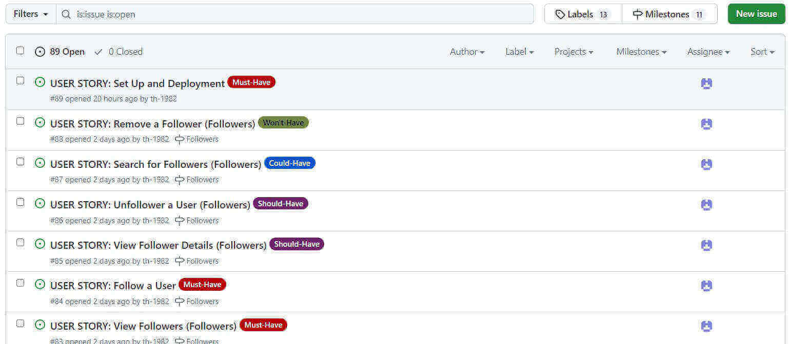
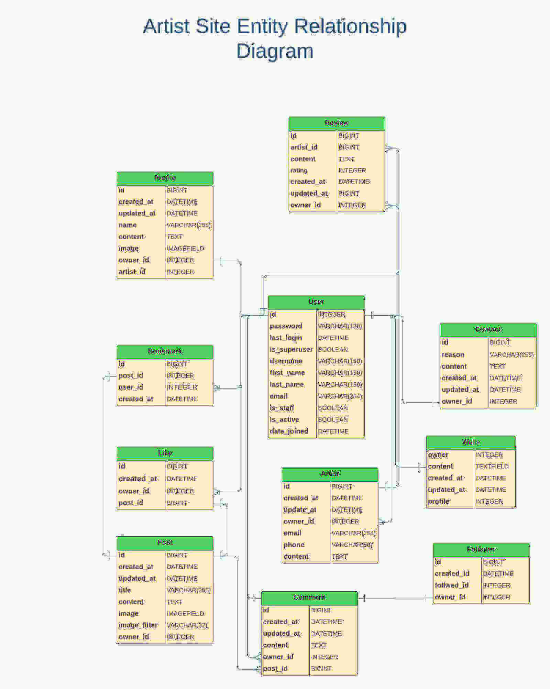

# Artistery Avenue API
"Artisery Avenue Api" is the backend service used by the [Artistery Avenue](https://) platform.
The deployed DjangoRESTFramework API can be found [here](https://th-1982-artistery-avenue-198c22334f81.herokuapp.com/)

# Purpose of the API:
To serve as the backend infrastructure for the front end by posting  (POST) and retrieving (GET) data from endpoints and performing create, read, update, and delete operations on objects users enter via the front end. 

## Planning & Agile:
This [project](https://github.com/users/th-1982/projects/12/views/1?visibleFields=%5B%22Title%22%2C%22Assignees%22%2C%22Status%22%2C74798578%2C74798580%2C74798579%2C%22Milestone%22%2C%22Labels%22%5D) was planned and developed using Agile methodology.

For this purpose, the project was illustrated by [11 initial Milestone](https://github.com/th-1982/artistery-avenue-api/milestones) entitled "Profiles", "Posts", "Likes", "Comments", "Followers", "Reviews", "Walls", "Artist", "Contacts" and "Bookmarks" providing the developer with the freedom to accomplish all issues/tasks flexibly before dates deadline set to March. The Milestones were broken according to their component's names.

Throughout the development process, new milestones were added, where tasks started from "Todo," progressing to "In Progress," and finally "Done." The issues were assigned to the sole developer and labeled as "could-have," "should-have," "must-have," and "won't-have".

In order of priority, with [88 closed User Stories](https://github.com/th-1982/artistery-avenue-api/issues), the Project has:

Must-Have:
- Models, Views, Serializers, Urls for "profiles/posts/comments/likes/reviews/walls/artists/bookmarks"
- Set Up and Deployment
- View Artist Profiles(Artists)
- Artist Profile Permission(Artists)
- View Bookmarks(Bookmarks)
- Bookmark Permission(Bookmarks)
- View Users Profiles (Profiles)
- Profiles Permissions (Profiles)
- View Posts (Posts)
- Create a Post (Posts)
- Post Permissions (Posts)
- View Comments (Comments)
- Create a Comment (Comments)
- View Likes(Likes)
- Like/Unlike a Post or Comment(Likes)
- Like Permissions (Likes)
- View Contacts (Contacts)
- View Reviews(Reviews)
- Reviews Permissions (Reviews)
- View Contact (Contacts)
- Create a Contact(Contact)
- Create a Review (Reviews)
- Wall posts Permissions (Walls)
- View Wall Post(Walls)
- Create a Wall post (Walls)
- View Followers(Followers)
- Follow a User(Followers)

Should-Have:
- Models, Views, Serializers, Urls for "followers/contacts
- Update Artist Profile(Artists)
- Filter Artists(Artists)
- Create a Bookmarks (Bookmarks)
- Update my Bookmarks (Bookmarks)
- Delete a Bookmarks (Bookmarks)
- View Users Detail Profile (Profile)
- Update User Profile (Profile)
- Delete User Profile (Profile)
- Filter Posts (Posts)
- Update my Post (Posts)
- Like a Post (Posts)
- Comment on a Post (Posts)
- View Comments Details (Comments)
- Update my Comment (Comment)
- Delete my Comment (Comment)
- View Like (Likes)
- Like/Unlike a Post (Likes)
- View Like Details (Likes)
- View Followers (Followers)
- Follow a User (Followers)
- Unfollow a User (Followers)
- View Follower Details (Followers)
- View a Contact Detailed (Contacts)
- Update My Contact(Contact)
- Delete My Contact (Contacts)
- Contact Premissions (Admin Contacts)
- View Contacts Details (Admin Contacts)
- View Reviews Details (Reviews)
- Update my Review (Reviews)
- View Wall posts Details (Walls)
- Update my Wall Post (Walls)

Could-Have:
- Models, Views, Serializers, Urls for "likes/admin contacts"
- Search for Artists(Artists)
- View Bookmark Details (Bookmarks)
- Search for Bookmarks (Bookmarks)
- View User Detail Profile (Profiles)
- Search for Posts (Posts)
- View Posts Details (Posts)
- Search for Comments (Comments)
- Like a Comment (Comments)
- Search for Reviews (Reviews)
- Search for Wall Posts (Walls)
- Search for Followers (Followers)
- Search for Contacts (Contacts)
- Delete a Contact (Admin Contacts)
- Update a Contact (Admin Contacts)

Wont-Have:
- Remove a Follower (Followers)
- Delete Artist Profile (Artists)
- Delete Multiple Bookmarks (Bookmarks)
- Delete Another User's Profile (Profiles)
- Delete Another User's Post (Posts)
- Delete Another User's Comments (Comments)
- Unlike Another User's Like (Likes)
- Delete Another User's Review (Reviews)
- Delete my Review (Reviews)
- Delete my Wall post (Walls)
- Delete Another User's Wall Post (Walls)
- Delete Another User's Contacts (Contacts)

The issues were closed, and the milestones were subsequently closed, too.

## Relationship Diagram
The relationship diagram for Artistry Avenue between models from an individual perspective can be best defined as follows:

- The [Profile](http) model serves as the central entity, featuring attributes such as owner (OneToOne), created_at (DateTimeField), updated_at (DateTimeField), name (CharField), content (TextField), image (ImageField with a unique filename generated by rename_file), and is_artist (BooleanField) indicating whether the profile is an artist.
- A [Post](http) created by a User Profile on Artistry Avenue and features the owner (ForeignKey), created_at (DateTimeField), updated_at (DateTimeField), title (CharField), content (TextField), image (ImageField), and image_filter (CharField) once submitted.
- The [Comments](http) model follows a similar structure, inheriting from the post (ForeignKey) and owner (ForeignKey). It displays the content (TextField), created_at (DateTimeField), and updated_at (DateTimeField) of the comment.
- The [Like](http) model is characterized by the owner (ForeignKey), post (ForeignKey), and created_at (DateTimeField).
- The [Followers](http) model is defined by owner (ForeignKey), followed (ForeignKey), and created_at (DateTimeField). It represents the relationship between profiles where one/many profiles can follow another.
- The [Artists](http) model extends the concept of profiles with additional attributes specific to artists. It inherits from the Profile model and includes fields such as owner (OneToOne), content (TextField), location (CharField), email (EmailField), phone (CharField), created_at (DateTimeField), and updated_at (DateTimeField).
- The [Bookmarks](http) model signifies the bookmarks created by users. It includes the post (ForeignKey), owner (ForeignKey), and created_at (DateTimeField). Users can bookmark multiple posts.
- The [Contact](http) model allows users to submit contacts featuring the owner (ForeignKey), reason (CharField), content (TextField), created_at (DateTimeField), and updated_at (DateTimeField).

Under Barker's notation, one/or many Users can create multiple Profiles or Artists, generating many Posts. Many Comments can be created on many Posts by one/many Profiles. Likes/Unlikes can be expressed on many Posts by one/many Profiles. Many Profiles can follow/unfollow other Profiles. Users can bookmark many Posts through the Bookmark model. Contacts are considered an isolated model, accessible by anyone, associating with many Users.

- I created the entity-relationship diagram using Lucidchart, following the conventions of Barker's notation.

## Methodology CRUD
When performing CRUD (Create, Retrieve, Update, Delete) function-based views, the following methods were used to manipulate the table in the database.

For such, to the subsequent endpoints:
/profiles/, /artists/, /posts/, /comments/, /likes/, /followers/, /reviews/, /walls/, /bookmarks/, /contacts/

- POST - Used to create an object to a list of (endpoint)
- GET - Used to retrieve a series of objects from a list of (endpoint)

Singularly, for the same endpoints past the primary keys:
/profiles/int:pk/, /artists/int:pk/, /posts/int:pk/int:pk/, /comments/int:pk/, /likes/int:pk/, /followers/int:pk/, /reviews/int:pk/, /walls/int:pk/, /bookmarks/int:pk/, /contacts/int:pk/

- GET - Used to view a single object in a list or (endpoint)
- PUT - Used to update a single object in a list of (endpoint)
- DELETE - Used to delete an existing single object from a list of (endpoint)

Users can then:
- CRUD Profiles
- CRUD Artists
- CRUD Posts
- CRUD Comments
- CRUD Likes
- CRUD Followers
- CRU Reviews
- CRU Walls
- CRUD Bookmarks
- CR Contacts

## Features and Functionality for Superusers

As a Superuser, one can perform the following via the [admin panel](https:):
- CRUD Posts
- CRUD Artists
- CRUD Comments
- CRUD Profiles
- CRUD Reviews
- CRUD Walls
- CRUD Contacts
- CRUD Bookmarks
- Change Passwords
- Promote users to Superuser

